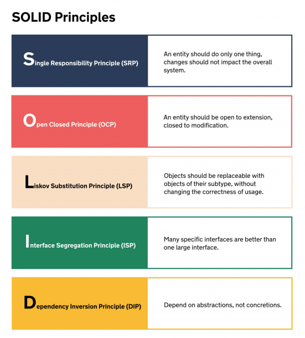

<!-- Begin README -->

<div align="center">
    <a href="https://github.com/Night-Owl-Labs/SOLID-Principles" target="_blank">
        
    </a>
</div>
<br>
<p align="center">
    <a href="https://github.com/Night-Owl-Labs"></a>
    <a href="https://x.com/reciperesizer"></a>
    <a href="mailto:support@nightowllabs.net"></a>
    <br>
    <a href="https://prgoptimized.com" target="_blank"></a>
</p>

---------------

<h1 align="center">SOLID Principles of Object Oriented Design (OOD)</h1>

**SOLID** is an acronym that represents five design principles intended to make software designs more maintainable, scalable, and flexible. These principles help developers create well-structured and robust code that is easier to understand, extend, and modify.



---------------

## Table of Contents

- [Introduction](#introduction)
- [List of Principles](#list-of-principles)
    - [1. Single Responsibility Principle (SRP)](#1-single-responsibility-principle-srp)
    - [2. Open/Closed Principle (OCP)](#2-openclosed-principle-ocp)
    - [3. Liskov Substitution Principle (LSP)](#3-liskov-substitution-principle-lsp)
    - [4. Interface Segregation Principle (ISP)](#4-interface-segregation-principle-isp)
    - [5. Dependency Inversion Principle (DIP)](#5-dependency-inversion-principle-dip)
- [Conclusion](#conclusion)
- [Code Examples](#code-examples)
- [What's Inside?](#whats-inside)
- [Resources](#resources)
- [License](#license)
- [Credits](#credits)

## Introduction

The SOLID principles were introduced by Robert C. Martin "Uncle Bob" in both a paper and a book. In his paper titled "[Design Principles and Design Patterns](docs/DesignPrinciplesAndPatterns.pdf)," published in 2000, Martin presented the five SOLID principles as guidelines for designing object-oriented software. These principles aimed to promote software designs that are more maintainable, scalable, and adaptable.

Later, in his book "[Agile Software Development, Principles, Patterns, and Practices](https://www.amazon.com/Software-Development-Principles-Patterns-Practices/dp/0135974445)," published in 2002, Robert C. Martin provided a more comprehensive explanation of the SOLID principles. The book elaborated on each principle and offered practical examples and guidelines for applying them in software design and development.

Since their introduction in the paper and further elaboration in the book, the SOLID principles have become widely accepted and followed by software developers worldwide. They have had a significant impact on the industry, fostering the creation of cleaner, more modular, and easier-to-maintain object-oriented code.

## List of Principles

The SOLID principles are as follows:

### 1. Single Responsibility Principle (SRP)

The SRP states that a class should have only one reason to change. It means that a class should have one primary responsibility and should not take on multiple unrelated responsibilities. By adhering to SRP, code becomes more maintainable, as changes to one responsibility are less likely to affect other parts of the system.

**SRP - Coupling and Cohesion**<br>
The Single responsibility principle is closely related to the concepts of coupling and cohesion.

**Cohesion** refers to what a class or module can **do**. When a class has *low cohesion*, it means that it does a great variety of actions and in that, the class is unfocused on what it should do. *High cohesion* means that the class is focused on what it should be doing as it contains only methods relating to the intention of the class.

**Coupling** refers to how related or *dependent* two classes or modules are towards each other. For *low coupled* classes, a major change in one class has a low impact on the other. *High coupling* in a system makes it difficult to maintain since a change in one class will have impact on other classes as well. This could result in one change flowing through a system as an oil slick, sometimes even requiring a full overhaul to fully implement.

Good software design consists of classes or modules with **high cohesion** and **low coupling**.

**Uncle Bob on SRP**<br>
[Robert C. Martin](https://blog.cleancoder.com/uncle-bob/2014/05/08/SingleReponsibilityPrinciple.html) (Uncle Bob) states that we define each responsibility of a class as a reason for change. If there is more than one reason to change a class, it probably has more than one responsibility.

> Gather together the things that change for the same reasons. Separate those things that change for different reasons.

In the context of cohesion and coupling, this means that in order to achieve this, we want to **increase the cohesion** between things that change for the same reasons, and we want to **decrease the coupling** between those things that change for different reasons.

In software, some examples of responsibilities that may need to be separated are the following:
- Notification
- Error handling
- Logging
- Formatting
- Parsing
- Persistence
- Validation
- etc.

### 2. Open/Closed Principle (OCP)

The OCP suggests that classes and modules should be open for extension but closed for modification. This principle encourages developers to design classes in a way that allows them to be extended to add new functionality without modifying existing code. This promotes code reuse and reduces the risk of introducing bugs when making changes.

### 3. Liskov Substitution Principle (LSP)

The LSP, developed by [Barbara Liskov](https://en.wikipedia.org/wiki/Barbara_Liskov), states that objects of a superclass should be replaceable with objects of its subclasses without affecting the correctness of the program. In other words, a subclass should be able to override methods from the superclass in a way that does not break the behavior of the program. Adhering to LSP ensures that the inheritance hierarchy is well-structured and maintains the expected behavior.

### 4. Interface Segregation Principle (ISP)

The ISP suggests that a class should not be forced to implement interfaces it does not use. Instead of having large, monolithic interfaces, the ISP encourages creating smaller, more specific interfaces tailored to the needs of each client. This helps avoid unnecessary dependencies and allows classes to implement only the methods they need.

### 5. Dependency Inversion Principle (DIP)

The DIP states that high-level modules should not depend on low-level modules but rather on abstractions. It also suggests that abstractions should not depend on details; instead, details should depend on abstractions. This principle promotes loose coupling between classes and facilitates easier substitution of implementations.

## Conclusion

By understanding and applying these SOLID principles, software developers can create code that is more flexible, maintainable, and resistant to changes, making it easier to adapt to future requirements and improvements. Each principle contributes to overall code quality and promotes best practices in software design.

## Code Examples

Code examples are provided in the [SOLID](./SOLID) folder of this repository.

> [!NOTE]
> The code examples are written in Java, but the principles can be applied to any object-oriented programming language.

## What's Inside?
A quick look at the top-level files and directories in this project. 

```bash
SOLID-Principles
    ├── SOLID        
    │   ├── SingleResponsibilityPrinciple
    │   │   ├── User.java
    │   │   ├── UserRepository.java
    │   │   └── Main.java
    │   │
    │   ├── OpenClosedPrinciple
    │   │   ├── Shape.java
    │   │   ├── Circle.java
    │   │   ├── Circle.java
    │   │   └── Main.java
    │   │
    │   ├── LiskovSubstitutionPrinciple
    │   │   ├── Bird.java
    │   │   ├── Ostrich.java
    │   │   └── Main.java
    │   │
    │   ├── InterfaceSegregationPrinciple
    │   │   ├── Notifier.java
    │   │   ├── NotificationService.java
    │   │   ├── EmailNotificationService.java
    │   │   ├── PhotoPrinter.java
    │   │   ├── PhotoPrinterAdapter.java
    │   │   ├── ConcretePhotoPrinter.java    
    │   │   └── Main.java
    │   │
    │   └── DependencyInversionPrinciple
    │       ├── Notifier.java
    │       ├── NotificationService.java
    │       ├── EmailNotificationService.java
    │       ├── SMSNotificationService.java
    │       ├── PhotoPrinter.java
    │       ├── PhotoPrinterAdapter.java
    │       ├── ConcretePhotoPrinter.java    
    │       └── Main.java
    │
    ├── docs
    │   ├── images
    │   │   ├── SOLID.png
    │   │   └── NOL.png
    │   └── DesignPrinciplesAndPatterns.pdf
    │
    ├── LICENSE
    │
    ├── README.md
    │
    └── .gitignore
```

## Resources

For further reading on the SOLID principles, check out the following resources:

- [SOLID Design Principles](https://www.coengoedegebure.com/solid-design-principles/): This article provides a concise overview of the SOLID principles and their importance in writing maintainable and extensible software.
- [SOLID Principles in a Nutshell](https://aymanmousliki.medium.com/solid-principles-in-a-nutshell-c802c9e8cd84): This is another article that provides a concise overview of the SOLID principles and their importance in writing maintainable and extensible software.
- [Clean Code: A Handbook of Agile Software Craftsmanship](https://a.co/d/7vwL9MB): Written by Robert C. Martin, also known as "Uncle Bob," this book delves into the principles and practices of writing clean, readable, and well-structured code. It covers various software development best practices, including SOLID principles, and offers valuable insights for aspiring and experienced developers.
- [Clean Architecture: A Craftsman's Guide to Software Structure and Design](https://a.co/d/6Z9UtvS): Penned by the renowned Robert C. Martin, often referred to as "Uncle Bob," this masterpiece provides a deep exploration into the foundations of software architecture. Drawing from timeless principles and best practices, the book illuminates the significance of creating robust, scalable, and maintainable software systems. Covering essential architectural principles and patterns, it serves as an indispensable resource for both novice and veteran software architects and developers.
- [Design Principles and Design Patterns](docs/DesignPrinciplesAndPatterns.pdf): For more advanced concepts in software design, including design patterns, you can refer to the document "DesignPrinciplesAndPatterns.pdf" located in the "docs" folder of this project. This resource delves into various design principles and common design patterns that facilitate flexible and reusable software architectures. Gain insights into powerful design techniques that can significantly improve your software development skills.
- [Wikipedia - SOLID Principles](https://en.wikipedia.org/wiki/SOLID): Visit this Wikipedia article to gain a comprehensive understanding of the SOLID principles. It provides in-depth explanations of each principle, their history, and practical examples to help you apply them in your software projects.
- [SOLID Principles of Object-Oriented Design](https://www.youtube.com/watch?v=TMuno5RZNeE): This video provides a brief overview of the SOLID principles and their importance in software design. It also offers practical examples to help you understand how to apply these principles in your projects.

## License

This project is released under the terms of the **MIT License**, which permits use, modification, and distribution of the code, subject to the conditions outlined in the license.
- The [MIT License](https://choosealicense.com/licenses/mit/) provides certain freedoms while preserving rights of attribution to the original creators.
- For more details, see the [LICENSE](LICENSE) file in this repository. in this repository.

## Credits

**Author:** [Night Owl Labs, LLC.](https://github.com/night-owl-labs) <br>
**Email:** [support@nightowllabs.net](mailto:support@nightowllabs.net) <br>
**Website:** [nightowllabs.net](https://www.nightowllabs.net) <br>
**Reference:** [Main Branch](https://github.com/Night-Owl-Labs/SOLID-Principles) <br>

---------------

<div align="center">
    <a href="https://nightowllabs.net" target="_blank">
        
    </a>
</div>

<!-- End README -->

